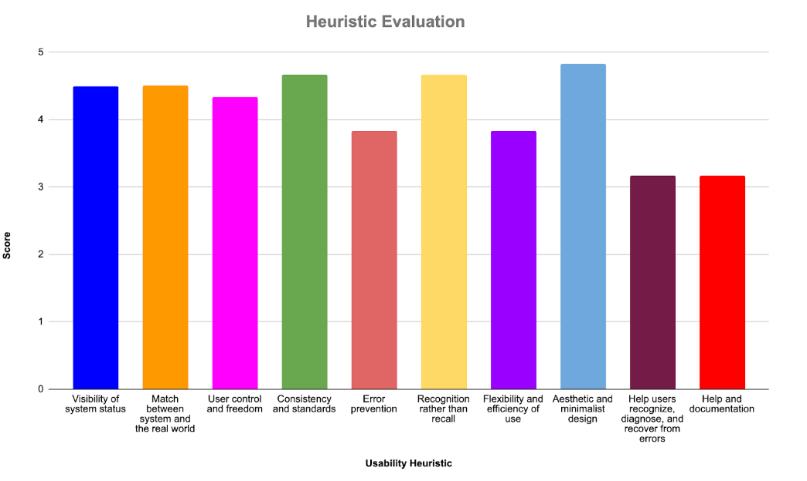

# Peer Testing Report

## Created by:
> Abdulaziz Almutlaq - 79960175  
Maysey Lu - 19226646  
Jordan Onwuvuche - 61007530  
Harman Sahota - 28337426  
>>
 

## Table of Contents
 

1. Project Description   
&nbsp;	1.1 Overview   
&nbsp;	1.2 Features  
&nbsp;      1.3 Technology Stack   
2. Peer Testing Session 	 
&nbsp;  2.1 Participants  
3. List of Usability Tasks  
&nbsp;   3.1 User Group: Volunteer  
&nbsp;   3.2 User Group: Admin  
4. Issues Discovered  
&nbsp;   4.1 Severity: High  
&nbsp;   4.2 Severity: Medium  
&nbsp;   4.3 Severity: Low  
5. Quantitative Scores

 

--- 

## Overview

Foodsaviour is a web application designed to minimize food waste by organizations by directing it to other sources rather than landfill. It also serves as an application with which organizations can generate a report for the government annually as well as share their resources among other organizations all while keeping track of this data and being able to compare it, view it as a graphic and compare the different data gathered over time. The web app aims to do  all this while maintaining safety of the data by performing user authentication and protecting the confidentiality of the data and that of the organization. 

## Features

The features presented for this user testing are as follows: 

- The user is able to successfully register an account.
- The user is able to successfully log in with an existing account. 
- If the user is an admin, they have access to the network, admin, tracker, and profile pages but if they are not an admin they only have access to the tracker and profile page. 
- On the tracker page, the user is able to create records for a food type listening to how much of it was directed to what place, the user enters in lbs, and kgs and the system automatically saves and converts it to percentages, the landfill amount is also auto-calculated.
- Once the user submits the form on the tracker page they are able to view their record in a table which gives them the option to delete that record, the user is also able to see a rough graph of the data. 
- On the profile page, the user is able to view details about their account listening to their name, email, and roles. 
- On the network page, the user is able to browse through posts, view only the sharing or only the receiving posts as well as search the posts by typing in a search bar. 
- On the network page, the user is also able to create posts and interact with the posts by commenting on them.
- On the admin page, the user is able to set permissions for access to each page as well as read/write permissions which are then stored in the database. 
- The user is also able to approve or decline accounts on the admin page, these accounts show in the appropriate table.

## Peer Testing Session

|Participant|Admin|Status|Evaluation Type|Tested On|
|-----------|-----|------|---------------|---------|
|Eunsuh Lee|Maysey Lu|Partially Completed|User Feedback|Nov. 30, 2022 (In-person)|
|Jonathan Chou|Maysey Lu|Completed|Think Aloud|Nov. 30, 2022 (In-person)|
|Anamica Sundareswara|Harman Sahota|Completed|User Feedback|Nov. 30, 2022 (In-person)|
|Tanner Wright|Harman Sahota|Completed|Think Aloud|Nov. 30, 2022 (In-person)|
|Neilansh Rajpal|Jordan Onwuvuche|Partially Completed|User Feedback| Nov. 30, 2022 (In-person)|
|Simran Brar|Jordan Onwuvuche|Partially Completed|Think Aloud|Nov. 30, 2022 (In-person)|
|Amritpal Aujla|Abdulaziz Almutlaq|Partially Completed|Think Aloud|Nov. 30, 2022 (Online)|

## List of Usability Tasks

### User Group: Volunteer

**Description:**
You are a 64 years old, retired bus driver that is not very familiar with technology and has only used a smartphone for making calls and texting. To pass time, you have decided to volunteer for ABC Farms, a local farm, which focuses on growing fresh produce such as apples, plums, and squashes. This is your first time working with them and has never heard of the Food Saviour website until now. You have been tasked to calculate how much food waste the organization has diverted from the landfill and use those results to create a report. 

**Tasks:**

1. Create an account.
2. View your profile.
3. Log out of your account.
4. Log into your account.
5. Enter data to figure out how much food waste the organization has diverted from the landfill so far.
6. Export your results.
7. Add some more data entries.
8. Download your results again.
9. Delete one or more data entries.

### User Group: Admin

**Description:**
You are the Admin of XYZ Farms which specializes in growing pumpkin, zucchini, and garlic. Your organization recently got some new volunteers and staff. Your manager has requested that you quickly approve their Food Saviour accounts so that they can start collecting the data needed to create a report that you will be presenting to the Board. You are looking to measure how much food you can save and distribute. You would also like to connect with other organizations that use the Food Saviour website.

**Tasks:**

1. Log into your account:
2. Change the access level(s) of two different roles. 
3. Approve or disapprove any pending accounts.
4. Browse through postings made by other organizations
5. Connect with any that you are interested in.
6. Create your own posting.
7. Search for your posting.

## Issues Discovered

### Severity: High

**Issue #1: Graphing**
Description: When the user saves data into the database, a graph is generated. However, the graph generated from the data did not match the data that was entered and if the user entered extreme data values, then the graph would malfunction and/or create a graph with very incorrect data values. The graph labels also overlapped, making some of the labels difficult or impossible to read. 

**Issue #2: Missing Information on Network Posts**
Description: When the user navigates to the network page, they see a list of postings made by them and other users. However, there is no way to tell who is the author of each posting because the post does not show the author’s name or organization. Nor does it show the date of when the post was created. 

**Issue #3: Ability to Edit Data**
Description: At the moment, there is no implementation to allow the user to edit any data that they have submitted. If the user enters the wrong data, they must delete the data entry and re-enter everything into the form and submit it again. If the user approves or declines the wrong account, there is no way to revert the action. If the user has a typo in their network post, there is no way to edit the post. And lastly, if the user wants to update their name, email, or organization, there is no way for them to do that unless they create a new account.

### Severity: Medium

**Issue #1: Differentiation Between User-entered Data and Auto-calculated Data**
Description: When the user enters data into the form, the percentage and values related to the landfill are automatically calculated. However, it was confusing for some users to know if they were auto-calculated or not unless they were paying attention to the changes and/or if they filled out the form in the order that was intended. Thus, there should be some way to differentiate the two types of data by either using a different font color or encapsulating the auto-calculated data into a separate box.

**Issue #2: The amount of information can be a bit overwhelming**
Description: The amount of information in the tracker and admin page can be a bit overwhelming , so an option to view some documentation/tutorial might be useful to guide the user through tasks to be done in case they are stuck.

**Issue #3: The data permissions table is confusing**
Description: The data permissions table in the admin page is confusing to the user, they have no idea about what to do in that table and the amount of information is overwhelming , the documentation can help here as well.

### Severity: Low

**Issue #1: System Messages**
Description: When the user submits a form, either saving a data entry or permission setting or submitting a post to the network page, there is no clear indication to the user that the form has been submitted successfully. The only way to know is by scrolling down the page to where the user expects to see the results of the form submission. Thus, there should be a message that appears, letting the user know if the form was submitted or not.

**Issue #2: Displaying Search Results**
Description: When the user searches using a keyword on the network page, it displays back the posts that include the keyword. However, if there are no postings with the matching keyword, the page is blank. This makes it unclear to the user whether the system is still searching for results or if there are no matching posts. Thus, there should be some indication that there were no posts containing the keyword.

**Issue #3: Display Issues for Different Screen Sizes**
Description: Not all pages and/or page elements are responsive to different screen sizes. For example, the registration page form stretches into the navigation bar and any error messages that appear causes the form fields to be pushed down and the form buttons to overlap with the form fields.

**Issue #4: The buttons on the register form can be confusing**
Description: The previous, next and register button are a bit confusing since at first the user gets confused on which button to press, The solution could be to play around with the colour of the buttons to differentiate them.

**Issue #5: The export csv button is hard to notice**
Description: The user missed the export csv button on the tracker page, since it has a design of having color only on the border outline its easy to miss, to make it more visible make it a solid color background instead.

## Quantitative Scores

**Visibility of system status**

From the results, one can tell that the participants were generally satisfied with the system as it showed them what was going on at most moments. However, the participants did highlight some issues on some pages such as the Network page. Some participants mentioned that they could not tell who the author of each posting was. Others were also curious to know when the post was made. These are things the group will work on.

**Match between system and the real world**

Based on the results, the participants were impressed with the degree of familiarity they experienced while using the website. They easily assimilated all the jargon and placement of various features. Although they were conversant with most features, some participants highlighted the responsiveness of the site. This is something the group will surely improve.

**User control and freedom**

Indicated by the outcome, most participants had a sense of freedom to roam around the site and execute various tasks with confidence. This can be attributed to the site wide navigation features that helped users get to wherever they needed to go.

**Consistency and standards**

Reflecting on the results, most participants did not have to wonder whether various terminology or features meant the same or different things. They had a smooth experience using the web pages because the group incorporated the goals of homogeneity throughout the construction of the website.

**Error Prevention**

From the results, it is easy to tell that different participants had mixed views and experiences on the ability of the website to prevent unexpected outcomes from arising. For example, some participants cited that they did not have the ability to edit the data submitted in a post on the network page. The group will definitely work to improve these error prevention measures.

**Recognition rather than recall**

Based on the results, we can tell that most participants did not have to recall from memory to complete any tasks. This can be attributed to the elements, action features that have been setup on all pages throughout the website.

**Flexibility and efficiency of use**

Indicated in the results, the participants had mixed experiences about their ability to execute different tasks through different pathways. This could have helped different personalities to pick whichever pathway suits them. Fortunately, the group is working on offering users more flexibility such as the ability to customize some things such as the input fields on the tracker page, and much more.

**Aesthetic and minimalist design**

From the results, one can easily infer that most participants had such a smooth experience on the website. They found the website contained only relevant information adequate to perform any related tasks, or bring some into reach. However, some participants found some features confusing such as the data permissions table on the admin page. The team will work to ensure that users find the information easier to assimilate and update.

**Help users recognize, diagnose, and recover from errors**

The results clearly communicate to the group that there is a considerable amount of work to be done to improve this area of the project. Participants had a rough time recovering from errors in various cases. One example is when a user enters incorrect data into a form; one would have to delete the form and start over instead of changing the field that needs to be changed. The group will make this area a top priority.

**Help and documentation**

The participants did not have any documentation to elaborate on the features of the system though it is always best when they do not have to go through the documentation. Nevertheless, the team will create this documentation shortly.

