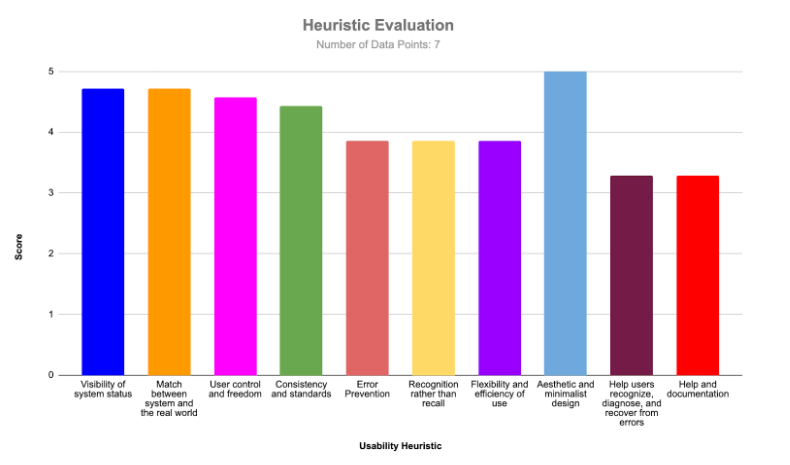

# Peer Testing Report #2

## Created by:
> Abdulaziz Almutlaq - 79960175  
Maysey Lu - 19226646  
Jordan Onwuvuche - 61007530  
Harman Sahota - 28337426  
>>
 

## Table of Contents
 

1. Project Description   
&nbsp;	1.1 Overview   
&nbsp;	1.2 Features  
&nbsp;      1.3 Technology Stack   
2. Peer Testing Session 	 
&nbsp;  2.1 Participants  
3. List of Usability Tasks  
&nbsp;   3.1 User Group: Volunteer  
&nbsp;   3.2 User Group: Admin  
4. Issues Discovered  
&nbsp;   4.1 Severity: High  
&nbsp;   4.2 Severity: Medium  
&nbsp;   4.3 Severity: Low  
5. Quantitative Scores

 

--- 

## Overview

Foodsaviour is a web application designed to minimize food waste by organizations by directing it to other sources rather than landfill. It also serves as an application with which organizations can utilize to generate data and visuals for annual reports as well as share their resources among other organizations. In addition, users of this online platform will be able to compare data, view it as a graphic and compare the different data gathered over time. The web app aims to do all this while maintaining safety of the data by performing user authentication and protecting the confidentiality of the data and that of the organization. 

## Features

The features presented for this user testing are as follows: 

- The user is able to register an account and log in with an existing account. 
- On the tracker page, the user can enter their data by selecting a food category, entering the total quantity in kgs or lbs, and the amount diverted to each source. The amounts are then auto-converted into percentages by the system. 
- Once the user saves the data on the tracker page, they are able to view their record in a data table which gives them the option to delete that record. The user is also able to see a pie chart generated from the data they have saved. 
- On the profile page, the user is able to view details about their account such as their name, email, and roles. They are able to edit their name and/or email and withdraw their consent. If the user withdraws their consent, they are prompted to download their data before withdrawing as their account would be deleted immediately after they confirm. 
- On the sharing page, the user is able to browse through posts, view only the sharing or only the receiving posts, search for posts by typing keywords in the search bar, create posts and sort posts using time filters. 
- On the sharing page, the user is also able to see a list of users they’ve shared food with and generate a graph to compare each other’s data.
- On the permissions page, the user is able to set permissions for access to each page as well as read/write permissions for each role.
- The user is also able to approve or decline accounts on the admin page and revert these selections. Once saved, these accounts appear in the appropriate table.

## Peer Testing Session

|Participant|Admin|Status|Evaluation Type|Tested On|
|-----------|-----|------|---------------|---------|
|Veronica Jack|Maysey Lu|Completed|User Feedback|March 15, 2023 (In-person)|
|Harshal Patel|Maysey Lu|Completed|Think Aloud|March 17, 2023 (In-person)|
|Ben Keeley|Harman Sahota|Completed|User Feedback|March 15, 2023 (In-person)|
|Illya Yereferenko|Harman Sahota|Completed|Think Aloud|March 17, 2023 (In-person)|
|Abhiek Bist|Jordan Onwuvuche||User Feedback||
|Akshaj Srinivasan|Jordan Onwuvuche|Completed|Think Aloud|March 17, 2023 (In-person)|
|Jake Daongam|Abdulaziz Almutlaq||User Feedback|(Online)|
|Abhiek Bist|Abdulaziz Almutlaq|Incomplete*|Think Aloud||

*The peer testing session with Abhiek Bist was not done due to the lack of time and inability to coordinate with Abhiek. The session was initially supposed to be done with Veronica Jack. A time and date was set up with her, however, it was later noticed that Veronica had already reviewed our website with another team member. Overall, there was a lack of organization from all sides.

## List of Usability Tasks

### User Group: Volunteer

**Description:**
You are a 64 years old, retired bus driver that is not very familiar with technology and has only used a smartphone for making calls and texting. To pass time, you have decided to volunteer for ABC Farms, a local farm, which focuses on growing fresh produce such as apples, plums, and squashes. This is your first time working with them and has never heard of the Food Saviour website until now. You have been tasked to calculate how much food waste the organization has diverted from the landfill and use those results to create a report. 

**Tasks:**

1. Create an account.
2. View your profile.
3. Log out of your account.
4. Log into your account.
5. Enter data to figure out how much food waste the organization has diverted from the landfill so far.
6. Export your results.
7. Add some more data entries.
8. Download your results again.
9. Delete one or more data entries.

### User Group: Admin

**Description:**
You are the Admin of XYZ Farms which specializes in growing pumpkin, zucchini, and garlic. Your organization recently got some new volunteers and staff. Your manager has requested that you quickly approve their Food Saviour accounts so that they can start collecting the data needed to create a report that you will be presenting to the Board. You are looking to measure how much food you can save and distribute. You would also like to connect with other organizations that use the Food Saviour website.

**Tasks:**

1. Log into your account:
2. Change the access level(s) of two different roles. 
3. Approve or disapprove any pending accounts.
4. Browse through postings made by other organizations
5. Create your own posting.
6. Search for your posting.
7. Change your first and last name.
8. Deactivate your account. 

# Issues Discovered

## Severity: High

Issue #1: Permissions Not Implemented

Description: Currently, everyone can see all the data regardless of whether they created that data, if it's from their organization, or even from a different organization altogether. This needs to be changed so that the only data shown to the user is either their own or data from someone else that they have received permission to access. This issue raises the concern of data privacy and protection. 

Issue #2: Profile Page Goes Blank

Description: When the user edits their data (i.e. name, roles, etc.) and submits the new changes, the page goes blank. However, the data is updated in the database and the user is able to see these changes once they log back in again. This can be resolved once we determine the reason why the page turns blank upon form submission.

Issue #3: Ability to Edit Data

Description: At the moment, there is no implementation to allow the user to edit any data that they have submitted. If the user enters the wrong data, they must delete the data entry and re-enter everything into the form and submit it again. If the user has a typo in their network post, there is no way to edit the post. Thus, it is of high priority that this feature is implemented in time for the final milestone. 

## Severity: Medium

Issue #1: Distinction Between User-entered Data and Auto-calculated Data

Description: When the user enters data into the form, the percentage and values related to the landfill are automatically calculated. However, it was confusing for some users to know if they were auto-calculated or not unless they were paying attention to the changes and/or if they filled out the form in the order that was intended. Thus, there should be some way to differentiate the two types of data by either using a different font color or encapsulating the auto-calculated data into a separate box. 

Issue #2: Too Much Information Displayed

Description: The amount of information in the tracker and permissions page can be a bit overwhelming and confusing to new users. Thus, it would be helpful to provide some sort of documentation that the users can refer to when they are unsure of the functionality of a page.

Issue #3: Cannot View Saved Permission Settings 

Description: When the user saves their permission settings and refreshes the page, all fields are cleared (although the permissions were saved into the database), making it confusing to the user whether their settings were saved. Thus, it would be helpful to have an alert notifying the user that the settings have been saved and also have the system pull the permissions data from the database and display it back to the user by pre-selecting the currently saved permission settings. 

Issue #4: Tootips/Information panels to provide more information on the graphs

Description: The pie chart on the tracker page only displays the data and labels but there’s no way to see what the actual numbers on the chart are. Thus, it would be nice to have that information displayed as tooltips on hover or in information panels.

## Severity: Low

Issue #1: System Messages

Description: When the user submits a form, either saving a data entry or permission setting or submitting a post to the network page, there is no clear indication to the user that the form has been submitted successfully. There is a confetti animation that plays, however, it sometimes does not work. The only way to know is by scrolling down the page to where the user expects to see the results of the form submission. Thus, there should be a message that appears, letting the user know if the form was submitted or not.

Issue #2: Displaying Search Results

Description: When the user searches using a keyword on the network page, it displays back the posts that include the keyword. However, if there are no postings with the matching keyword, the page is blank. This makes it unclear to the user whether the system is still searching for results or if there are no matching posts. Thus, there should be some indication that there were no posts containing the keyword. 

Issue #3: Display Issues for Different Screen Sizes

Description: Not all pages and/or page elements are responsive to different screen sizes. For example, the registration page form stretches into the navigation bar and any error messages that appear causes the form fields to be pushed down and the form buttons to overlap with the form fields. Thus, we must ensure that all elements are responsive and the CSS used does not force it to be a specific size. 

# Quantitative Scores

Number of Data Points: 7

Visibility of System Status
From the results, it is obvious that the software system exceeded the expectations of most participants by demonstrating with great clarity the outcome of their prior interactions in a timely manner. The participants could also easily predict the next steps in their interactions. However there are still aspects of the program to improve. For example on the Sharing page when the user submitted a form while sharing a post, the participants preferred to receive a clear indication that the form had successfully been submitted.

Match Between The System and the Real World
Based on the results, the participants easily related the system to real-world conventions as they found the layout to be organized naturally and logically. This means that the participants found the system easy to understand due to the similar arrangement of various features compared to other programs they’ve used before. Although they were greatly satisfied, the team will improve on this through implementing various changes including a clear differentiating demarcation between input fields and calculation fields on the tracker page.

User Control and Freedom
Indicated by the outcome, most participants could intuitively undo an action, exit a certain process and leave a certain page easily. They experienced the freedom to roam around the site and execute various tasks with the confidence of being able to navigate the system the way they like to. This is attributed to the implementation of site wide features including the navigation bar and buttons in various locations and pages across the site.

Consistency and Standards
Reflecting from the results, we can see that the participants didn’t have to wonder where they were, what they were doing, or how things worked. This means that they didn’t have to wonder what various terminology and features meant. Therefore we are glad that they experienced a hassle free use of our system. This can be traced to various implementations across the website that all had one goal in mind, homogeneity. This is seen in the colors, font faces, shapes, and other aspects.

Error Prevention
From the results, we can see that various participants had mixed experiences and perspectives on the site’s ability to prevent unexpected outcomes from happening or being sustained.  This means that the site did not adequately prevent problems from occurring in the first place nor did it warn the user about them. One of the main concerns raised that the team will work on is to give users the ability to edit the data that they entered into the tracker table.

Recognition Rather than Recall
Based on the result outcome, participants had mixed feelings and experiences using the website. This means that some had to recall from memory how the site works while others did not. One of the reasons this is the case is the working process on the sharing page to do with the plotting of the line graph. The team will work to make this more intuitive.

Flexibility and Efficiency of Use
Indicated in the results, the participants had mixed experiences and perspectives to offer on the liberty they had to execute the tasks through multiple ways. This means that there were less ways than some expected to go about a task in a faster manner. This indicates that frequent actions could become more tedious or frustrating for the daily user. The reason being that the website was designed specially for non tech savvy users. However, the team is working to offer users more flexibility in various sectors, especially to do with the tracker page functionality.

Aesthetic and Minimalist Design
It’s obvious from the result that the participants were blown away by the aesthetics of the website. They enjoyed their experience on the website and found it to contain only the relevant information just enough to successfully execute tasks required. The team will work to ensure that more features are not created at the expense of the design.

Help Users Recognize, Diagnose, and Recover From Errors
Although the team has placed some effort in this aspect, the results clearly indicate  that there is more to be done to recognize potential errors before they occur and alert the users before they confirm any action. Such changes are already on the team’s radar such as allowing users to change already entered tracking data.

Help and Documentation
From the results, the team can reasonably conclude that it would be best to provide documentation describing with utmost clarity how to accomplish some tasks and how different features work. This can be in different areas of the website such as the sharing of products, Tracking data, and even the change of access to data within an organization. This is necessary to provide users with a step by step process on how to realize their goals as they use the site.
