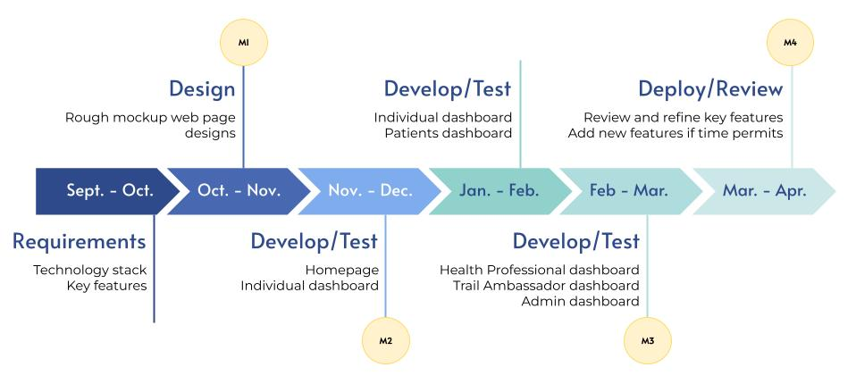

# Requirements Report

## Created by:
> Abdulaziz Almutlaq - 79960175  
Maysey Lu - 19226646  
Jordan Onwuvuche - 61007530  
Harman Sahota - 28337426  
>>
 

## Table of Contents
 

1. Project Description   
&nbsp;	1.1 Overview   
&nbsp;	1.2 Target User Groups  
&nbsp;      1.3 Technology Stack   
2. System Architecure 	 
&nbsp;  2.1 Data Flow Diagrams (DFDs)  
3. Requirements  
&nbsp;   3.1 Estimated Timeline  
&nbsp;   3.2 Functional Requirements  
&nbsp;   3.3 Non-functional Requirements  
&nbsp;   3.4 Environmental Constraints  
4. Testing Strategy  
&nbsp;   4.1 Testing Tool  
&nbsp;   4.2 Testing Techniques

 

--- 

## Overview

Alongside Dr. Barbara Marcolin and two other groups from this course, we are designing and refining the online community platform, HEALTHENOW.com, that was created by Dr. Marcolin and her team before the pandemic. The inspiration for this website was to allow small businesses and non-profit organizations to use this technology who otherwise would not have access to it due to insufficient funding. 

The Okanagan Rail Trail is supported by Friends of the Okanagan Rail Trail (FORT), which is a non-profit organization that consists of local volunteers. They are the ones that organize activities and fundraisers and increase user experience on the trail. To support this group, the online platform we are redesigning will be used to host their wellness challenge, which is one of their annual fundraising events. In addition, this website will include information about the Okanagan Rail Trail to help promote and spread awareness of the efforts FORT has done to increase user trail experiences, such as storyboards placed along the trail that tell the origins, history, and stories of the Okanagan Rail Trail. In addition, this website will also allow professionals such as doctors, nurses, dieticians, wellness coaches, and more from Dr. Robert Petrella’s Lifestyle Prevention Program to oversee the progress and statistics of the wellness challenge participants to provide free consultations to Lake Country users. 

## Target User Groups

The final product of this project is designed to serve **four** main user groups: individuals, consented individuals, working professionals, and trail ambassadors.

**Individuals**

*Individuals* refer to the community members of Lake Country and the Okanagan. These users can access the website to view an interactive map of the Okanagan Rail Trail or view announcements and alerts made by the ORT trail ambassadors. In addition, if the *individuals* create an account and consent to having their data collected and stored in our database, they will gain access to many more features. These features include the ability to enter tracker data and have it converted into visual graphics and participate in weekly challenges.

**Consented Individuals**

*Consented individuals* have access to all the functionality of the *individual* user group but vary slightly such that they are able to have professionals analyze their tracker data and provide feedback on how to improve and reach their wellness goals and can interact with other *consenting individuals*. *Individuals* can become *consented individuals* by giving permission to the *professionals* to view their data or giving permission to the system to generate progress comparison graphics between *consented individuals*. When giving permission, they are able to limit what type of data is shared and always have the option to revoke their permission as well. Furthermore, *consented individuals* have the ability to join or form teams to create friendly competition between users while completing the challenges, as well as discuss amongst one another using the discussion board.

**Professionals**

*Professionals* refer to people who are certified and authorized to provide feedback and advice to the *consented individuals*. This group is not limited to healthcare workers such as doctors, nurses, and dieticians, but also includes other professionals such as health and wellness coaches. Using the data that the *consented individuals* have allowed them to view, the professionals are able to analyze the graphs and make comments on what they have done well for the week, and what they can improve on for the following week to help them reach their goals. Furthermore, the data that can be viewed by a *professional* is dependent on what type of role they have, such that they can only view data that is relevant to their profession or area of expertise.

**Trail Ambassadors**

*Trail ambassadors* are workers and volunteers of the Okanagan Rail Trail that are responsible for organizing events and weekly challenges. This user group will have administrative access to the website, such that they will be the ones to authorize and assign the roles to the professionals. In addition, the *trail ambassadors* will be able to create, update, or delete events in a calendar for all *individuals* to see, post alerts and announcements on the home page, and have access to a list of emergency and non-emergency contacts.

## Tech Stack

**Front-End:**

&nbsp; 1. HTML  
&nbsp; 2. CSS with Bootstrap  
&nbsp; 3. Java script  
&nbsp; 4. Django CMS  
&nbsp; 5. Figma for designing  

We decided to use HTML and CSS as these are the building blocks of any website. In addition, we are using Bootstrap with CSS as this helps our website be responsive enough to run on any device regardless the screen width. Javascript will be used for validating form inputs to prevent data attacks like SQL injections.

We decided to use Django against other frameworks like FastAPI and Flask because of the ease of coding, updated documentation, and its compatibility with HTML. The client believes that Django has all the functionality that is needed for the website she wants us to build while other frameworks are lacking in some areas. It also provides a lot of built-in libraries and APIs which will help us in our project.

We are using Figma for designing as this tool helps us work on the designs together collaboratively. Moreover, we can create design prototypes in Figma which is helpful when showing these designs to the client as they can interact with the prototype rather than imagine how navigating through the pages would work. 

**Back-end and Database**

&nbsp; 1. MySQL database integrated in MariaDB.  
&nbsp; 2. Django  

The backend was provided to us by the client as she already has a database made in MySQL and wants to integrate it with MariaDB.
 

**Testing and Bug Tracking**

&nbsp; 1. Github issues for bug tracking.  
&nbsp; 2. Pytest for code testing.  
&nbsp; 3. MS-Excel for keeping a code testing record.  

The client requested us to use GitHub issues for bug tracking since all of our code will be put into a GitHub repository and that way, she will be able to view our progress. In addition, using GitHub issues reduces the number of softwares and programs that will need to be installed onto our personal computers. This tool is also beneficial because we have integrated GitHub notifications to our group’s Discord server, so all members are notified immediately once an issue has been created so that we can rectify them in a timely manner.  

## Data Flow Diagrams (DFDs)

HEALTHENOW users will interact with the HEALTHENOW system to perform different actions. These actions are dependent on what type of user they are. 

As an individual, they will interact with the system by giving consent to having their data stored into the database, and then use the website to enter tracker data and have that data converted into visual graphics. Similarly, a consented individual will have access to all the functionality of an individual, but also be able to create teams for the weekly challenges and view their team members progress to form a leaderboard. In addition, consented individuals are able to receive feedback from the professionals. As a professional, they are able to view the data of the consented individuals both numerically and graphically, and provide feedback as to what was done well and what can be improved so that the consented individual can reach their goals. Lastly, as a trail ambassador, they are able to assign roles, view the overall progress of the challenge, and create/edit/delete events from the calendar. All of these functionalities require querying the database in order to validate credentials, create teams and events, generate graphs and rankings, and retrieve information, and much more. 

The login process involves the user entering their email and password. This data is then queried in the database where it is authenticated to check if the user exists in the database. If the account exists and the correct email-password combination was entered, the user can log into the dashboard their credentials give them access to. However, if the incorrect credentials were entered, the user is prompted to enter the account credentials again. If the account does not exist, the user can create a new account and those account credentials will be stored into the database. This will be completed with the homepage by Milestone #2.

The tracker data is stored in the database, provided the users have consented to doing so. This data is then used to generate graphs to provide the user with a visual representation of their data. Ideally, this would be completed by Milestone #2, but will definitely be done by Milestone #3 if there were any issues. 

If the user has given permission to the professionals to view this data, they will also be able to view these graphs. When the professionals give feedback to the user, it is stored in the database and displayed back to the user alongside the appropriate graph(s). This will be completed by Milestone #3 with the professional dashboard. 

When forming teams, a form must be submitted into the database so that it can assign users to a team. Once the teams are formed, the database is queried to generate a leaderboard by comparing all the team members' statistics. Graphs can also be generated and displayed using this data. As these functionalities are associated with the individual dashboard, it should be completed by Milestone #3 at the latest. 

As trail ambassadors, they have the ability to assign roles to ensure that each user is able to access the appropriate dashboard. To do so, a list of active accounts is retrieved from the database and displayed back to them where they can search through the list to assign certain accounts to have access to the professional dashboard and trail ambassador dashboard. In addition, trail ambassadors have the ability to edit and add events to the calendar. Once they have entered the event details and saved it, it will be stored in the database. There is also the functionality to delete an event which is done by removing the event details data from the database. This features should be completed by Milestone #3 with the trail ambassador dashboard.

## Timeline

The client has yet to define the milestones and deliverables she wishes for us to accomplish. Thus, we have created our own visualization of the timeline, based on the COSC 499 milestones, that we hope to follow for the duration of this project. Currently, we are in the process of designing mockups of all the web pages. Once we have finalized the design and received approval from the client, we will begin coding. 

As seen above in Figure 3, we’ve divided the timeline based on each dashboard. We believe this is the most logical and efficient way to approach this project as most of the dashboards are dependent on each other. Thus, it would make sense to complete one dashboard before moving on to the next one to ensure that all features are working as expected. In addition, the individual dashboard contains the most content because not only does it need to record data, but it also needs to be able to convert that data into various types of graphs and display it back to the user. Hence, more time is allocated to complete this dashboard as all the other dashboards are dependent on it. We’ve also decided to work on the patient dashboard while we complete the individual dashboard because their contents overlap with each other. 

Ideally, we hope to have all the dashboards completed by mid-March so that we can focus on testing the website as a whole to ensure that all features are functioning as expected. This will also allow us time to fix the code if any issues arise during this testing and refine it to be cleaner and more professional so that the client is able to understand and maintain it even after the project is completed. If time permits and the client approves, we hope to add additional features that the client has currently not yet implemented to further enhance the website. 

## Functional Requirements

**Homepage**

When users navigate to the HEALTHENOW.com website, they will first see the homepage. At the moment, we are still in discussion with the client as to what kind of information she wants to be presented on this page. However, it has been confirmed that the user can create an account or log into an existing one from here. 

Thus, it is important that our homepage is intuitive such that it is easy for users to tell where to click to log in or register an account. In addition, it is crucial that the system is able to validate these account credentials. When the user logs into their account, the system should be able to verify that the account exists and that the email-password combination is correct. If the user is creating an account, the system should be able to check if there is an account associated with the entered email already, ensure the password created is valid and secure by checking to make sure it meets the password criteria, and send a confirmation email to the user once the account has been successfully created. If there are any issues, the system should be able to alert the user and provide steps as to how to resolve them. 

Since our client has not defined what she wants on the homepage, our team has come up with a few potential features for her to consider implementing on the homepage. This includes a section that explains the details of the wellness challenge, such as what it is, what is the duration of the challenge, and the reason why the Okanagan Rail Trail is hosting such an event. We have also thought of including an ‘About’ section where users can learn more about the Okanagan Rail Trail and Dr. Robert Petrella’s Lifestyle Prevention Program. Lastly, we are thinking of embedding the Google Map that the Okanagan Rail Trail has modified that highlights specific spots on the trail, such as where garbage cans and washrooms are located and scenic spots to take photos. Because this may cause the webpage to become very long, we may split these features across multiple pages but still make them accessible to all users without needing to log in or create an account. 

As these are all content pages, we must ensure that all page links are up-to-date and not broken and provide the administrator access and the ability to update these page contents when necessary. Furthermore, the information should be presented in a way that is understandable, organized, and aesthetically pleasing to engage users. 
The development of this page will begin once we have finalized a design with the client, which we hope will be by the end of October. And since these pages are relatively simple, it should not take us very long to code so we hope to have it completed by mid-November.

**Individual Dashboard**

The individual dashboard includes a tracker page where the user can input their weekly tracker data from the challenge. This dashboard will be programmed to check and ensure the validity of the user's input, convert the data into graphical illustrations, and display those graphs back to the user where they see a visual representation of their progress. The users of this dashboard will also have the ability to set up weekly goals, this encourages them to chase their goals and achieve better results from the weekly challenges. Additionally, there will be a discussion board where team members will be able to communicate with one another, this ensures that everyone is on the same page and is in sync with everything related to the challenge.

Through the individual dashboard, the users will also have the ability to register into teams for the weekly challenges. Moreover, once teams have been formed, the system will have the ability to generate graphs that include all the team members' data so that they can compare their progress among themselves. Additionally, participants within the same team will be able to view the rankings of each team member; this further increases the competitiveness within the team and encourages the participants to be more involved in the weekly challenges. This means the system must be able to compare data between users within a team and sort them based on what data is considered good (high-ranking) and bad (low-ranking). 

As this dashboard is accessed by the most users, we hope to start working on it as soon as we can, which is potentially at the beginning of November when the designs for this dashboard have been mostly finalized and complete most of the functionality of this dashboard by the beginning of December in order to meet the Milestone 2 deadline for the first round of peer testing.

**Trail Ambassador Dashboard**

The trail ambassador dashboard is mainly concerned with the calendar where the trail ambassadors can enter important dates and scheduled events. Thus, it is important that the system we create allows the trail ambassadors to create, update or delete the events in the calendar with ease. To ensure that the trail ambassadors do not accidentally delete an event, the system will generate an alert to confirm the action before completing it. In addition, the system will send a reminder message to save changes in case the trail ambassador tries to exit the page without saving.

In addition, it is important for the trail ambassador to be able to view how well the challenge is doing in terms of participation. Hence, this dashboard will allow the trail ambassadors to view a visual representation of the challenge statistics such as the number of participants in the weekly challenge and the overall progress of the challenge. Moreover, the trail ambassador dashboard will contain a list of emergency and non-emergency contacts and affiliates contacts so that they are easy to access in case they are needed.

**Professional Dashboard**

The professional dashboard is where the data is turned into relevant information by different personnel. But before this process can begin, the users must first consent to the utility of their information for different purposes explained in the privacy policy.

Through this dashboard, the professionals that work in Dr. Robert Petrella’s Lifestyle Prevention Program will be able to retrieve various user data collected such as physical activities, foods consumed, blood pressure, weight, and even average cigarettes smoked. The physical data will be tabulated to reflect program progress and will be presented alongside graphs, hence enhancing readability and understanding. Different kinds of graphs will be available to select from given varying preferences. Furthermore, users will be categorized into groups and given a rating of poor, good, etc. to compare the progress between other groups. 

Using the various data collected, the professional will be able to perform specialized diagnoses for each consented user and come to relevant conclusions that will benefit the user. This feedback could contain recommendations on lifestyle changes that can act as targets that the user should try to attain. These changes could have something to do with sleeping, smoking, or physical activity habits. Once the professional has generated feedback, it will be displayed back to the user with the appropriate graphs.

We aim to begin building this dashboard at the beginning of February and have it completed by the beginning of March.

**Patient Dashboard**

The patient dashboard is accessed by the consented individuals user group and consists of pages where graphs will be displayed to visualize physical activity data, health data, and dietary data.The health data could include number of hours slept in a day and the number of cigarettes smoked in a given time period. Dietary information visualized could include the average fruit and vegetable servings consumed per time period specified and the number of servings consumed during breakfast. The different kinds of data graphically rendered on the dashboards will be utilized by Dr. Petrella’s health professionals team to provide relevant health feedback to the community members of Lake Country. 

What makes this different from the individual dashboard is that there will be a box next to these graphs where the user can see the comments relevant to that graph that the certified professionals made. In addition, there will be a to-do list where users can easily view the advice the professionals have given them for the week to follow at a glance. 

We aim to start working on this dashboard in January and have it completed by mid February.

**Administrator Dashboard**

At the moment, the administrator dashboard is used to view a list of all the accounts created and assign roles and authorize certain accounts to gain access to specific dashboards. This is necessary to ensure that any newly added trail ambassadors and working professionals can access certain features to perform their tasks and responsibilities. Thus, it is crucial that the system is able to assign roles and give access to the correct accounts, as well as be able to generate an easy-to-read table of all the accounts registered in the database. 

This dashboard will be worked on once all the other dashboards are mostly completed (if not all) so that we can test whether its functionality works with all the user groups and dashboards, which will hopefully be by the end of February so that it is completed in time for Milestone 3, which is the second round of peer testing scheduled in mid-March. 

## Non-functional Requirements

**Milestone #1: Requirements Report**  
1. Install the Virtual Machine and set up Linux, this helps secure our actual device as Linux os provides better security, as well as the virtual machine, provides a separate environment.  
2. Install MySQL setup MySQL localhost. The database is scalable by using MySQL as this allows the size of the data set to be flexible.  
3. Install and set up PuTTY and generate SSH key pairs. This helps us secure our code once we start coding. 
4. Install and set up CISCO VPN. This ensures that we are working in a safe environment and secures our code. 
5. Create designs for webpages using Figma, keeping in mind that the graphics are able to handle the traffic on the website. By doing this, we make sure our design is adaptable to different devices. 

**Milestone #2 Peer Testing #1:**

1. To finish making the prototype, we have to make sure the prototype has good usability (i.e. is easy to navigate and does not have any lags).  
2. We also have to make it robust so that it degrades under stress. 

**Milestone #3 Peer Testing #2:**

1. We have to ensure that the code is efficient (code has the most optimal run time and space), taking into consideration the performance aspect (execution speed, response time, and throughput).  
2. The code needs to be reliable (fault-tolerant, meant-time to failure, data backups).  
3. The code should also be adaptable in the sense that adding functionalities is simple. 
4. A well-written program that contributes to overall security. 

**Milestone #4 Product Delivery:**

1. The final product must meet all of the previous non-functional requirements  
2. We have to also make sure the final product is efficient (it has no bugs and runs as expected), such that it uses a limited amount of resources on a device while providing a good experience to the user.

## Environmental Constraints

**Programming Languages**

We have to make sure that we use programming languages that can be used across old as well as new technology, different devices, and operating systems. This means that the technologies used should possess versatility and portability characteristics. This presents us with a challenge whose solutions we have fortunately derived. These technologies might have to be updated given the rapidly changing technology landscape.

**Maintenance Accessibility**

The project currently faces two main constraints in this regard. The first is finding qualified personnel for maintenance consultation in a timely manner. A solution the team has come up with is to book qualified personnel on campus ahead of time for maintenance checks. The second maintenance constraint is to ensure the software is left in a structural state that is easily grasped by any other qualified personnel and also sustainable for the longest time possible. This is why the team has chosen the Django content management system whose structural infrastructure fits the goals of the project.

**Health Tragedies**

In this day and age, we face increasing unprecedented health tragedies of various scales with the most recent being the global Coronavirus pandemic. If another pandemic or similar health tragedy arises , the Lake Country and Okanagan community could witness identical health protection policies imposed on them. These policies could inhibit them from hosting and participating in outdoor, physical activities and events.

**Weather Fluctuations**

Similarly, we face increasing unprecedented weather calamities on increasing scales. The Okanagan area has recently been a host to increasing forest fires and heat waves. To fan the flames, the proximity to the United States and the valley landscape make the Okanagan a suitable host to the traversing smoky winds. These dangerous weather conditions such as forest fires can have extremely detrimental health repercussions. Thus, these risks could heavily influence low participation in weekly challenges that involve outdoor activities.

## Testing Strategy

**Testing Technique**

Testing is extremely important. Therefore, the right testing strategy can aid in identifying any possible defect with the code while also ensuring continuous integration of new features is being adopted with no issues. We have decided to test our code using a regression testing approach.

Regression testing is a type of software testing that runs after every change made to the code; This is done to ensure that any additional change (additional features) is integrated without any unintended breaks. Essentially, we are avoiding the possibility of an old bug breaking the code in the later stages of the project.

For our initial features, we will be running unit tests for every code addition. We do so to ensure that we have a solid base, a code that lacks bugs. Doing so will allow us to perform regression testing for the additional features we add as we move on. We have to be selective with the tests we run as it may not feasible to test every single code addition added to our repository.

**Testing Tools**

For our unit testing, we will be using Pytest as our software testing framework, this will be extremely useful and compatible since we are using Django for both frontend and backend. Pytest is also extremely efficient in the sense that it will allow us to execute multiple tests parallely.

Finally, we will be conducting some usability testing to ensure that our dashboard designs do what we intend them to do. To do that, we have to develop the mock designs of our different dashboards on Figma and then run some usability testing to gather feedback from different users. This will allow us to identify the most ideal placement and format for the features in our dashboards.

## Questions

How will the homeless access the application?
> After speaking with the client again, the homeless will not be one of the target user groups right now due to the lack of information we have and the complexity of organizing a way for them to get access. Once we have formed the foundation of the website, we may consider adding them back into the user groups again. 

Does the client have experience in Linux systems?
> No, however, there is IT Support on campus which the client plans to utilize.

What security standards will you be using?
> We will be using a VPN to hide our web activity and create a secure connection as well as using wired networks and avoiding unsafe network pathways. We will also be coding within a virtual machine. In the later phases of development, we will also look into encryption and other security practices since we will be dealing with personal user data. 

Will Vanilla Javascript be enough for your front end? Do you believe you will need to use any other frameworks?
> Vanilla Javascript is not enough for the frontend, which is why we will also be using the Django framework which has the functionality that we need for this application.

What about users that fall under multiple groups? Will they need to manage multiple accounts or can they switch between profiles?
> In the database, there is a category for assigning roles to each account. This role will then allow them to access the specific dashboards. One user can have access to numerous dashboards, given that they are authorized to have access. These roles are assigned by those who have admin access. At the moment, this is the client, however, in the future, this access will be given to the trail ambassadors. 

Can a user chat with Trail Ambassadors or health professionals?
> As of right now, we haven’t thought of implementing this chat functionality yet since we are focused on implementing the key features first. However, this is something that we can consider and bring it up to the client once we have completed the minimal requirements. 

Load testing was included in your testing part during the presentation, how will it be performed exactly?
> This was part of the initial testing strategy planned. We have developed that testing strategy while lacking some key information. After re-developing the testing strategy, load testing is not part of the testing plan as it may not be feasible; time will be the main constraint.

Why do you choose to do a server for the storage?
> This is provided by the client, she has an SQL database which she wants to use. 

Why are there two separate databases instead of one database with different tables?
> Our initial data flow diagrams had two databases: one for account credentials and one for tracker and feedback data. We’ve now revised that so that those variables are in the same database since they are related to each other.

Will the administrators or volunteers be able to update links without the help of a developer?
> Yes, the trail ambassadors will be given admin access to update information on the website once our client has handed over the application to them.

If there are environmental constraints that cancel or postpone an event, do you have a notification plan in place? (e.g., email all users involved, the dashboard is a brighter colour, alert at the top of the page)
> There will be a content box where users can view notifications posted by the trail ambassadors. 

What is the benefit of posting weekly challenges via this service rather than an existing one such as Strava?
> While Strava is a great application, what we are creating goes beyond Strava’s functionality because we are not only tracking physical activity data, but also data regarding the users’ eating and lifestyle habits, and then using that data to provide personalized advice from certified professionals on how to improve their health and wellbeing. 

Are both dashboards accessible via the same portal?
> Yes, all the dashboards are accessible within the same website. The user has the ability to navigate between different dashboards depending on what kind of access their roles gives them.

What security will be implemented for health information
> Security is such a sensitive matter which will be dealt with by the client. What we can do is program efficiently to avoid any possible vulnerabilities. The better we write the code, the lower the chance of any vulnerabilities appearing.

Will confidential health information be stored? If so, would you be encrypting the files & data for security? Or will you have another method to handle that?
> This functionality will be introduced later into the development as for now we’re just focusing on the required important functionality that the client wants. This is something we will definitely look into, however, because we are still in the beginning works of the project, we haven’t gotten to it yet. 
