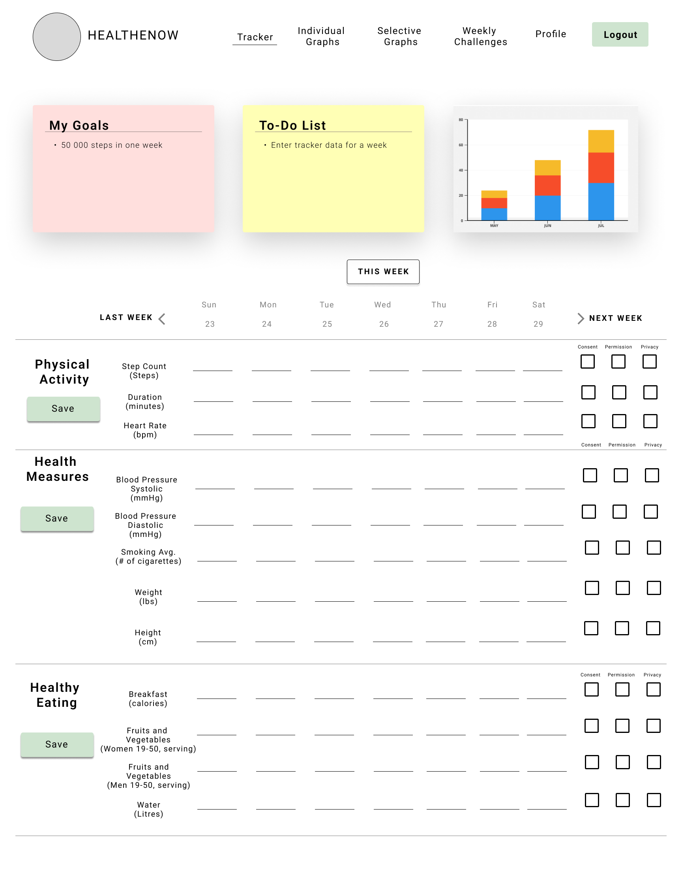
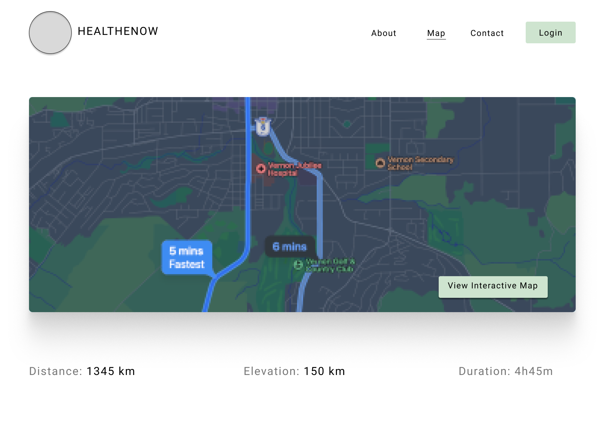

# Figma Mockup Design Review

### Landing page:

- There should be four icons on this page that helps the user navigate where they want to navigate to after they login.

### Individual graphs:

- The feedbacks are not meant to be on this page. They are meant to be on a complete different page. Therefore, remove the feedback text box.

### Login page:
- This page was approved by the client.

### Registration page:
- This registration page was partially approved by the client. However, we need to include an option where the users can select their roles.
- A consent form should also be added.

### Selective Graphs : Physical Activity

- figure out how to add one big feedback message in that box. 

### Selective Graphs : Health Measures

- figure out how to add one big feedback message in that box. 

### Selective Graphs : Healthy Eating

- figure out how to add one big feedback message in that box. 

### Profile 

- add height
- this page should display all available information about the user for example their role, weight, name, email etc.

### Tracker

- Switch the placement of "My Goals" and "To-Do List"
- Do not divide data into categories 
- Data entry should be in boxes instead of lines to make it easier to distinguish between data entries
- Cannot use checkboxes for consent, permission, privacy due to it not being a simple yes or no answer

### Hover Menu

- Do not use a hover menu option because there is a group of retired users that will be using this website and they do not know what "hovering" means
- Be sure to list out the full name of the page; do not use acronyms (i.e. Trail Ambassador instead of TA)

### Weekly Challenge

- Main focus of this page are the graphs and the discussion board
- Move Discussion Board to be on the right side and vertical instead of horizontal
- Move Leaderboard underneath Discussion Board
- Leaderboard should contain the team names, not the users
- Figure out a way to label the data so that the user knows which bar is theirs and a way to display the team members
- Graphs should be labeled so users know which data is used
- This page is used to compare progress between **teams** not team members. Adjust design to work with that

### Trail Map

- Map should be placed on landing page with flexible resolution

### Trail Ambassador Page

- Trail Ambassadors are mostly retired people.
- Some TAs will be an admin
